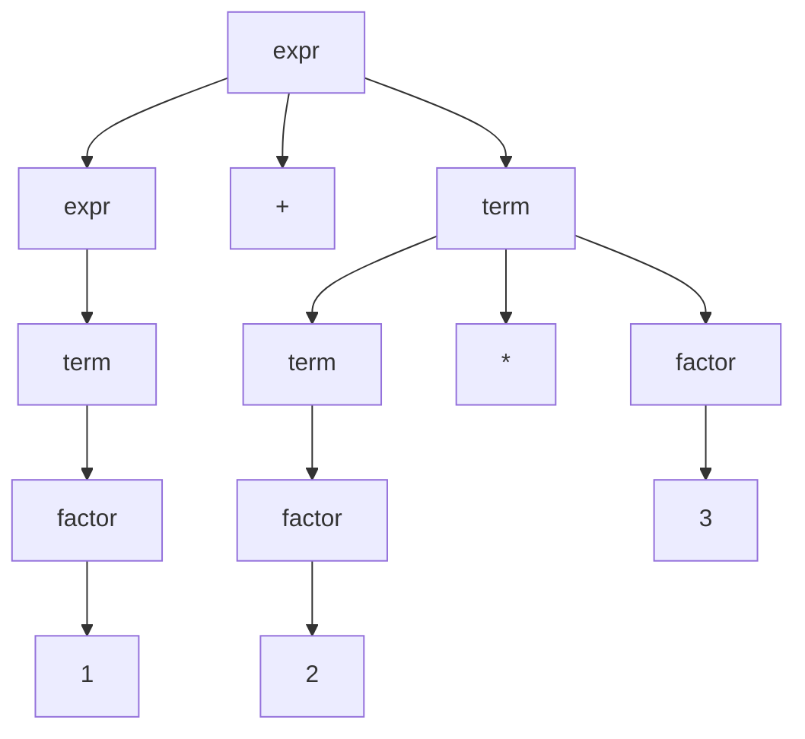
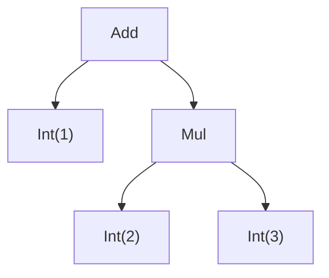
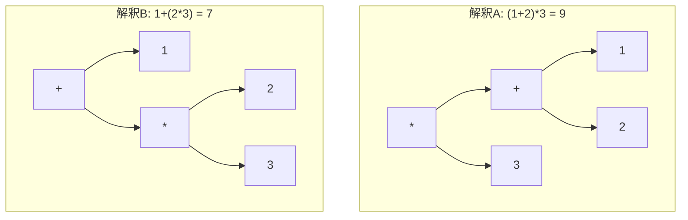

# 文法と構文木の基礎

前章で「文法に従ってトークン列を木に組み上げる」と述べました。では、その**文法**とは具体的に何なのでしょうか。コンピュータが従える「文法」は、自然言語の文法のような曖昧なものではなく、数学的にきっちり定義された形式的な対象です。本章では、構文解析を語るうえで欠かせない共通言語 ── 文脈自由文法、導出、構文木と抽象構文木、そして曖昧性 ── を一通り押さえます。ここで定義する用語は本書全体で繰り返し使うので、丁寧に進めます。

## BNF：文法を書き表す記法

まず、文法を紙の上に書くための記法から始めましょう。最も広く使われるのが **BNF（Backus–Naur Form, バッカス・ナウア記法）** です。BNF では、言語の構造を「規則（rule）」の集まりとして表します。簡単な足し算・掛け算の式を表す文法を BNF で書くと、こうなります。

```text
expr   ::= expr "+" term
         | term
term   ::= term "*" factor
         | factor
factor ::= "(" expr ")"
         | number
```

記法の読み方を一つずつ確認します。

- `::=` は「左辺は右辺のように構成される」と読みます。
- `|` は「または」を表し、複数の選択肢を区切ります。`expr` は「`expr "+" term` という形」**または**「`term` という形」のどちらかだ、という意味です。
- `"+"` や `"*"` のように引用符で囲まれたものは、入力にそのまま現れる具体的な記号です。これを **終端記号（terminal symbol）** と呼びます。前章のトークンに対応します。
- `expr`・`term`・`factor` のように、さらに別の規則で展開されていく名前を **非終端記号（nonterminal symbol）** と呼びます。これは「式」「項」「因子」といった構造の**名前**です。

このように、終端記号（具体的な記号）と非終端記号（構造の名前）を組み合わせて言語の形を定義したものが文法です。

> [!NOTE]
> BNF には方言や拡張がいくつもあります。繰り返しを `*` や `+`、省略可能を `?` で書ける **EBNF（拡張BNF）** がよく使われ、`{ ... }`（0回以上の繰り返し）や `[ ... ]`（省略可能）といった記法も登場します。本書では文脈に応じて使い分けますが、本質は同じ「規則による定義」です。

## 文脈自由文法

上のような BNF が表現している数学的な対象を、**文脈自由文法（Context-Free Grammar, CFG）** と呼びます。「文脈自由」という言葉に身構える必要はありません。これは「ある非終端記号をどう展開するかは、その記号の**前後の文脈に関係なく**決められる」という性質を指すだけです。`expr` は、まわりに何があろうと常に同じ規則で展開できる、というわけです。

文脈自由文法は形式的には4つの要素から成ります。

1. **終端記号の集合**：入力に現れる記号たち（`+`, `*`, `(`, `)`, number）。
2. **非終端記号の集合**：構造の名前たち（expr, term, factor）。
3. **生成規則の集合**：上で書いた `::=` の規則たち。
4. **開始記号**：文法全体の出発点となる非終端記号（ここでは `expr`）。

文脈自由文法は、1950年代に言語学者ノーム・チョムスキーが自然言語の構造を記述するために導入した枠組みに由来します。それがプログラミング言語の構文記述に驚くほど適合することが分かり、以来コンパイラ理論の中心的な道具になりました[](#cite:aho2006)。なぜ適合するかといえば、前章で述べた「プログラムの構文は再帰的」という性質を、`expr ::= expr "+" term` のように規則が自分自身を参照することで自然に表現できるからです。

> [!NOTE]
> ただし、実在のプログラミング言語の**すべて**を純粋な CFG だけで表せるわけではありません。識別子が型名か変数名か（C の `typedef`）、改行やインデントをどう扱うか（Python のインデント構文など）、宣言済みの名前に応じて構文の解釈が変わるか、といった点は、字句解析や意味解析、あるいはパーサ内の追加状態と組み合わせて扱われます。CFG は「構文の骨格」を表すための中心的な道具だと考えるとよいでしょう。実例は最終章で見ます。

## 導出：文法から文を生み出す

文法は「正しい文の集合」を定義します。ある文字列がその言語に属するかどうかは、開始記号から規則を繰り返し適用してその文字列を**作り出せるか**で決まります。この「作り出す」手続きを **導出（derivation）** と呼びます。`1 + 2 * 3` を導出してみましょう（number はそのまま数字に展開できるとします）。

```text
expr
⇒ expr "+" term            (expr ::= expr "+" term を適用)
⇒ term "+" term            (左の expr ::= term)
⇒ factor "+" term          (term ::= factor)
⇒ 1 "+" term               (factor ::= number, number=1)
⇒ 1 "+" term "*" factor    (term ::= term "*" factor)
⇒ 1 "+" factor "*" factor  (term ::= factor)
⇒ 1 "+" 2 "*" 3            (残りを number に展開)
```

各ステップで非終端記号を一つ選び、その規則の右辺に置き換えています。最終的に終端記号だけの列 `1 + 2 * 3` にたどり着けたので、この文字列は文法の言語に属する、と判定できます。

構文解析とは、ある意味でこの導出を**逆向きにたどる**作業です。与えられた `1 + 2 * 3` から出発して、「どんな規則をどう適用すればこれが作れたのか」を復元する。その復元結果こそが、次に説明する構文木です。

## 構文木と抽象構文木

導出の過程を、文字列ではなく木の形で記録したものが **構文木（parse tree, 具象構文木 / concrete syntax tree）** です。木の根は開始記号、内部のノードは非終端記号、葉は終端記号で、各内部ノードはその規則の適用を表します。`1 + 2 * 3` の構文木は次のようになります。



構文木は導出のすべてを忠実に記録しているので、`term` や `factor` といった「中継ぎ」のノードまで含まれ、かなり冗長です。後段の処理にとって、`factor ::= number` という規則をどう通ったかは興味がありません。知りたいのは「`1` と『`2`×`3`』の足し算だ」という本質だけです。

そこで、構文木から本質的でないノードを削ぎ落とし、意味のある構造だけを残したものが、前章で登場した **抽象構文木（AST）** です。同じ式の AST は、こうなります。



`expr`・`term`・`factor` の区別は消え、演算子と被演算子だけが残りました。「具象構文木は文法の都合を反映した木、抽象構文木は意味の構造を反映した木」と区別すると分かりやすいでしょう。実際の言語処理系では、構文木を律儀に作らず、パースしながら直接 AST を組み立てるのが普通です。本書で単に「木を作る」というときは、たいてい AST を指します。

> [!TIP]
> AST のノードをどう設計するかは、言語処理系の作り手の裁量です。上の例では足し算を `Add`、掛け算を `Mul` という別ノードにしましたが、`BinOp(op, left, right)` のように演算子を属性として一つのノードにまとめる設計もよく使われます。「正解の AST」が一つに決まっているわけではありません。

## 曖昧性という落とし穴

文法を設計するとき、注意しなければならない厄介な性質が **曖昧性（ambiguity）** です。ある文字列に対して、**構造の異なる構文木が2つ以上存在する**とき、その文法は曖昧であると言います。

先ほどの文法は曖昧ではありませんでした。`expr ::= expr "+" term`、`term ::= term "*" factor` という階層構造が、掛け算を足し算より「深い」位置に強制し、`1 + 2 * 3` の解釈を一通りに定めていたからです。ここで、もし文法をズボラに次のように書いてしまったらどうなるでしょう。

```text
expr ::= expr "+" expr
       | expr "*" expr
       | "(" expr ")"
       | number
```

この文法で `1 + 2 * 3` をパースすると、構文木が2通りできてしまいます。



計算結果が 9 と 7 で食い違ってしまいました。どちらが正しいかは文法だけからは決められません。曖昧な文法は、人間にとっての「掛け算が先」という常識を表現しそこねているのです。

曖昧性への対処には、大きく二つの方向があります。

- **文法を書き直す**：最初に示したように、`expr`／`term`／`factor` と階層を分けて、優先順位と**結合性**（同じ優先順位の演算子を左右どちらからまとめるか）を文法の形に埋め込む。
- **文法の外で優先順位を宣言する**：多くのパーサージェネレータは「`*` は `+` より優先」「`+` は左結合」といった指示を文法とは別に書ける仕組みを持っています。これは第4章で実際に使います。

> [!WARNING]
> 有名な曖昧性の例に「ぶら下がり else（dangling else）」問題があります。`if a then if b then x else y` の `else` が、内側と外側どちらの `if` に属するのか、素朴な文法では決まりません。C言語系では「最も近い `if` に結びつける」と規約で定めて解決しています。曖昧性は理論上の話に留まらず、現実の言語設計に顔を出すのです。

## まとめ

本章では構文解析の共通言語を整えました。要点を振り返ります。

- **文法**は終端記号・非終端記号・生成規則・開始記号からなり、BNF で書き表す。プログラミング言語の構文は **文脈自由文法** でうまく記述できる。
- 文法は **導出** を通じて「正しい文の集合」を定義し、構文解析はその導出を逆にたどって木を復元する作業である。
- パースの出力は、文法の都合を反映した **構文木** ではなく、意味の構造だけを残した **抽象構文木（AST）** であることが多い。
- **曖昧性** は文法設計の落とし穴であり、文法の書き換えや優先順位宣言で解消する。

これで道具立ては揃いました。次章では、ここで定義した文法をもとに、実際に動くパーサを自分の手で書いてみます。理論が実際のコードへどう落ちるのか、その手応えを掴みましょう。
