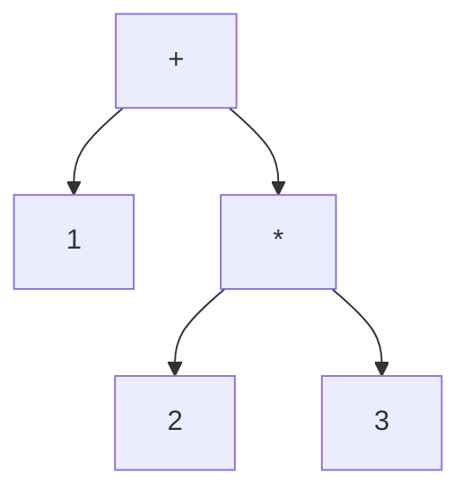
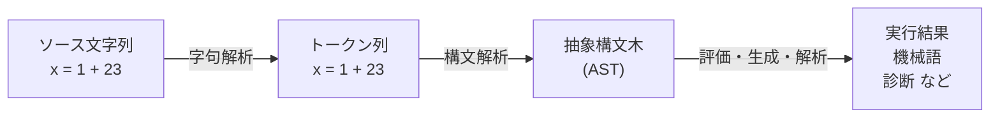

# 構文解析へようこそ

コンピュータは、私たちが書いたプログラムのテキストをそのまま「理解」しているわけではありません。`x = 1 + 2 * 3` という一行は、ファイルの中ではただのバイト列、つまり文字`x`・空白・`=`・空白・`1`……と続く平坦な並びにすぎません。この平坦な文字列から、「変数 `x` に、`1` と『`2` と `3` の積』を足した結果を代入する」という**構造**を取り出す作業 ── それが **構文解析（parsing）** です。本章では、なぜパースするのか、パース結果が何の役に立つのか、そしてパースがどんな流れで進むのかを、具体例を通して見ていきます。

## なぜパースするのか

プログラムを扱うソフトウェアを作ろうとすると、ほぼ必ず「テキストを構造に変える」必要が出てきます。たとえば次のような道具を考えてみましょう。

- **コンパイラ**：C言語のソースを機械語に翻訳する。
- **インタプリタ**：Python のソースをその場で実行する。
- **リンタ／フォーマッタ**：コードのスタイル違反を指摘したり、自動で整形したりする。
- **設定ファイルの読み込み**：JSON や YAML を読んでオブジェクトに変換する。
- **電卓アプリ**：`(1 + 2) * 3` という入力を計算する。

これらはどれも、入力テキストの「意味」を扱う前に、まず「形」を把握しなければなりません。`1 + 2 * 3` を計算するには、掛け算が足し算より先に評価されるという**優先順位**を、文字列のどこにも書かれていないにもかかわらず読み取る必要があります。`if (x) y;` を実行するには、`x` が条件で `y;` が本体だと**くくり方**を決めなければなりません。

この「形を把握する」処理を、その場しのぎの文字列操作（`split` や正規表現の継ぎ接ぎ）で済ませようとすると、入れ子の括弧や演算子の優先順位を前にしてすぐ破綻します。なぜなら、プログラミング言語の構文は本質的に**再帰的**（入れ子になりうる）だからです。括弧の中にまた括弧があり、式の中にまた式がある。こうした再帰的な構造をきちんと扱うために、構文解析という体系立った技術が必要になるのです。

> [!NOTE]
> 「正規表現では括弧の対応をチェックできない」という有名な事実があります。これは理論的な裏付けがあり、第6章「パーサの理論」で**文脈自由文法**と**正規言語**の違いとして詳しく説明します。いまは「正規表現だけでは足りない場面がある」とだけ覚えておいてください。

## パースの結果は何に使われるのか

構文解析が出力するものは、ほとんどの場合 **抽象構文木（Abstract Syntax Tree, AST）** と呼ばれる木構造です。AST は、プログラムの構造を「親子関係を持つノードの木」として表現したものです。先ほどの `1 + 2 * 3` は、次のような木になります。



この木を見れば、`2 * 3` が先にまとまっていて、その結果と `1` が足されることが一目で分かります。優先順位の情報が、木の**形そのもの**に埋め込まれているわけです。いったんこの木さえ手に入れば、後段の処理は驚くほど多彩に展開できます。

- **評価（実行）**：木を根からたどりながら計算すれば、インタプリタになります。`+` ノードなら左右の子を評価して足す、というように。
- **コード生成**：木を機械語やバイトコードに変換すれば、コンパイラのバックエンドになります。
- **静的解析**：木をたどって「使われていない変数」や「nil になりうる箇所」を探せば、リンタやバグ検出ツールになります。
- **変換・整形**：木を少し書き換えてからテキストに戻せば、フォーマッタやリファクタリングツールになります。
- **メトリクス計測**：木の形から循環的複雑度などを測れます。

つまり AST は、テキストという「人間に優しい表現」と、後続処理が扱いやすい「機械に優しい表現」をつなぐ**ハブ**なのです。現代のコンパイラ理論の標準的な教科書であるドラゴンブック[Aho et al., 2006](#cite:aho2006)も、コンパイラの構成をこの AST を中心に据えて説明しています。AST という共通の中間表現があるからこそ、フロントエンド（パース）とバックエンド（実行・生成）を分離して設計できるのです。

## パースの基本的な流れ

では実際、テキストから AST までどんな段階を踏むのでしょうか。伝統的な言語処理系では、大きく二段階に分けます。

### 字句解析：文字を「単語」にまとめる

最初の段階が **字句解析（lexical analysis, lexing）**、別名 **トークン化（tokenization）** です。これは、文字の並びを意味のある最小単位 ── **トークン（token）** ── にまとめる処理です。たとえば `x = 1 + 23` は、次のようなトークン列になります。

```text
識別子(x)  代入(=)  整数(1)  プラス(+)  整数(23)
```

ここで重要なのは、`23` という2文字が1個の「整数トークン」にまとめられ、意味のない空白が捨てられている点です。字句解析を担当するプログラムを **字句解析器（lexer, スキャナ）** と呼びます。レクサがやっているのは、いわば文章を「単語」に区切る作業です。トークンの種類（整数なのか識別子なのか）を **トークン種別**、その具体的な文字列（`23` や `x`）を **字句（lexeme）** と呼びます。

トークンの種類はたいてい正規表現で定義できます。「整数は数字が1個以上並んだもの（`[0-9]+`）」「識別子は英字で始まり英数字が続くもの」というように。正規表現で表せる範囲は、ちょうど字句解析にぴったりなのです。

### 構文解析：「単語」を木に組み上げる

次の段階が、本書の主題である **構文解析（parsing）** です。字句解析器が吐き出したトークン列を入力とし、それを文法に従って木へ組み上げます。この処理を担当するプログラムが **構文解析器（parser, パーサ）** です。

字句解析と構文解析の関係は、自然言語の読解にたとえると分かりやすいでしょう。字句解析は文字列を単語に区切る作業、構文解析は単語の並びから「主語・述語・目的語」といった文の構造を組み立てる作業に対応します。



この二段構えには理由があります。文字単位の細々した処理（空白の読み飛ばし、数字をまとめる）を字句解析に押し込めておくと、構文解析は「トークンという綺麗な部品」だけを相手にでき、文法の構造に集中できるのです。役割を分けることで、両方がシンプルになります。

> [!TIP]
> 後の章で触れますが、この二段構えを**あえて崩す**設計もあります。字句解析を行わず文字を直接パースする「スキャナレスパース」や、PEG のように字句と構文を一体で扱う方式です。二段に分けるのはあくまで伝統的・標準的なスタイルであって、絶対の決まりではありません。

### 意味解析へ ── パースの後にあるもの

構文解析はあくまで「形」を扱う段階で、「意味」までは踏み込みません。たとえば `x + 1` をパースできても、「`x` が文字列だったら足し算できない」といった型のチェックは、構文解析の仕事ではありません。それは AST を受け取った後段の **意味解析（semantic analysis）** が担当します。

本書では構文解析（テキスト→AST）に焦点を当て、意味解析やコード生成には深入りしません。とはいえ「パースのゴールは AST を作ること、その AST が後段の全処理の土台になること」という大きな地図は、常に頭に置いておいてください。

## 本書のこれから

ここまでで、パースの動機（再帰的な構造を扱うため）、ゴール（AST を作る）、流れ（字句解析→構文解析）という骨格を押さえました。次章ではもう一段だけ理論的な準備をします ── 「文法」とは何か、AST とはどんな木なのか、という言葉の定義を固めます。その準備ができたら、第3章でいよいよ自分の手で小さなパーサを書き始めます。

入口はここまで見てきたとおり素朴ですが、本書の後半では、この素朴な処理が数十年にわたる理論研究の積み重ねの上に立っていることが見えてくるはずです。それでは先へ進みましょう。
