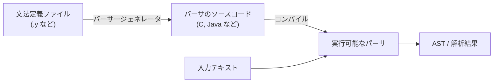

# パーサージェネレータを使った開発

前章では文法を手でコードに翻訳しました。関数を一つ一つ書く作業は、文法が小さいうちは楽しいものですが、規則が数百に膨れ上がる本物の言語では保守のコストが大きくのしかかってきます。そこで強力な選択肢になるのが **パーサージェネレータ（parser generator）** です。これは「文法を入力すると、その文法を解析するパーサのソースコードを自動で吐き出してくれる」道具 ── いわば「パーサを作るプログラム」です。文法を一箇所に宣言的に書いて管理できるのが強みです。とはいえ「手書きが不可能になる」わけではありません ── 最終章で見るように、本物の言語処理系でも手書きパーサは広く使われています。問題になるのは、どの部分を文法記述で宣言的に管理し、どの部分を手続き的なコードで制御するか、という設計上のトレードオフです。本章では、この系統で最も歴史が長く影響力の大きい **yacc／Bison** を題材に、ジェネレータを使った開発の流れを体験します。

## パーサージェネレータという発想

手書きパーサの弱点は「文法とコードが二重管理になる」ことでした。文法を変えるたびにコードを直さねばならず、両者がずれてバグの温床になります。パーサージェネレータは、この関係を逆転させます。**文法こそが唯一の真実（single source of truth）**であり、コードはそこから機械的に導かれる派生物になるのです。



この発想の元祖が **yacc（Yet Another Compiler-Compiler）** です。1975年、ベル研究所の Stephen Johnson が開発しました[](#cite:johnson1975)。yacc は文法ファイルを読んで C 言語のパーサを生成する道具で、UNIX とともに広まり、コンパイラ構築の標準的な道具となりました。yacc が内部で使うのは、Knuth が1965年に理論を打ち立てた **LR 構文解析**[](#cite:knuth1965)という強力なボトムアップ方式です（理論的な中身は次章で詳しく扱います）。今日では yacc の自由ソフトウェア版である **GNU Bison** が広く使われており、本章でもこれを用います。

> [!NOTE]
> 構文解析の方式は大きく**トップダウン**と**ボトムアップ**に分かれます。前章の再帰下降は、開始記号から木を下向きに作るトップダウンでした。yacc／Bison が使う LR 系は、逆に入力（葉）の側から木を上向きに組み上げる**ボトムアップ**方式です。ボトムアップは前章で苦労した**左再帰をそのまま扱える**という大きな利点があります。

## 字句解析器とのペア ── Flex

Bison はパーサを生成しますが、その入力となるトークン列は誰かが用意しなければなりません。前章では正規表現で字句解析器を手書きしましたが、ここも自動化できます。**Flex（lex の後継）** は、正規表現の一覧から字句解析器を生成する道具で、Bison とペアで使うのが定番です。yacc には lex、Bison には Flex ── パーサージェネレータとレクサジェネレータの二人三脚が、伝統的な処理系開発のスタイルです。

電卓のための Flex 定義ファイル `calc.l` を書いてみましょう。

```c
%{
#include "calc.tab.h"   /* Bison が生成するトークン定義 */
#include <stdlib.h>
%}

%%
[0-9]+      { yylval = atoi(yytext); return NUMBER; }  /* 数字列→NUMBER */
"+"         { return PLUS; }
"-"         { return MINUS; }
"*"         { return STAR; }
"/"         { return SLASH; }
"("         { return LPAREN; }
")"         { return RPAREN; }
[ \t]+      { /* 空白は読み飛ばす（何も返さない） */ }
\n          { return EOL; }
.           { /* それ以外の文字は無視 */ }
%%
```

`%%` で区切られた中央部分が規則です。各行は「正規表現 → 実行するCコード」という対応で、前章で書いた `TOKEN_SPEC` とほぼ同じ内容を宣言的に書いているにすぎません。`yytext` はマッチした文字列、`yylval` はそのトークンに付随する値（ここでは数値）を後段のパーサへ渡すための変数です。手書きのループは消え、「何が何のトークンか」という宣言だけが残りました。

## 文法ファイルを書く

いよいよ本丸の Bison 文法ファイル `calc.y` です。構造は「定義部」「規則部」「補助コード部」の3つに `%%` で分かれます。

```c
%{
#include <stdio.h>
int yylex(void);
void yyerror(const char *s);
%}

/* --- 定義部: トークンと優先順位を宣言 --- */
%token NUMBER
%token PLUS MINUS STAR SLASH LPAREN RPAREN EOL

%left PLUS MINUS      /* + と - は左結合・優先順位は低い */
%left STAR SLASH      /* * と / は左結合・優先順位は高い（後の行ほど高優先） */

%%
/* --- 規則部: 文法と意味アクション --- */
input:
      /* 空 */
    | input line
    ;

line:
      EOL
    | expr EOL        { printf("= %d\n", $1); }   /* 結果を表示 */
    ;

expr:
      NUMBER              { $$ = $1; }
    | expr PLUS  expr     { $$ = $1 + $3; }
    | expr MINUS expr     { $$ = $1 - $3; }
    | expr STAR  expr     { $$ = $1 * $3; }
    | expr SLASH expr     { $$ = $1 / $3; }
    | LPAREN expr RPAREN  { $$ = $2; }
    ;
%%

/* --- 補助コード部 --- */
void yyerror(const char *s) { fprintf(stderr, "エラー: %s\n", s); }
int main(void) { return yyparse(); }
```

ここには前章との大きな違いがいくつもあります。順に見ていきましょう。

### 文法がほぼそのまま書ける

`expr: expr PLUS expr` という規則に注目してください。前章では左再帰が無限ループを招くため、わざわざ繰り返しへ書き換えました。ところが Bison ではこの**左再帰をそのまま書いて構いません**。むしろ Bison では左再帰のほうが効率が良いとされます。ボトムアップ方式が左再帰を自然に扱えるという、先ほど触れた利点が効いているのです。BNF とコードのあいだの距離が、手書きのときよりずっと近くなりました。

### 優先順位を宣言で与える

前章では `expr`／`term`／`factor` という階層を文法に作り込んで優先順位を表現しました。ここでは文法は `expr` 一段だけで、代わりに定義部の `%left` で優先順位と結合性を**宣言**しています。

```c
%left PLUS MINUS      /* 優先順位: 低 */
%left STAR SLASH      /* 優先順位: 高（後に書いた行ほど高い） */
```

`%left` は「左結合」を意味し、書いた順序が優先順位の低→高を表します。これにより、文法 `expr: expr PLUS expr` 自体は曖昧（前章で見た2通りの木ができる文法）であるにもかかわらず、Bison は宣言に従って `1 + 2 * 3` を `1 + (2 * 3)` と正しく解釈します。前章で予告した「文法の外で優先順位を宣言する」方式が、まさにこれです。曖昧な文法を書いておいて、曖昧さの解消だけを別途指示する ── これは実用上とても便利で、四則演算のように演算子が多い言語で文法を簡潔に保てます。

### 意味アクションで木を組む

`{ $$ = $1 + $3; }` のような波括弧の部分を **意味アクション（semantic action）** と呼びます。規則が認識（**還元 / reduce**）されるたびに、この C コードが実行されます。記号 `$1`・`$3` は規則の右辺の1番目・3番目の記号の値を、`$$` は規則の左辺（結果）の値を指します。`expr PLUS expr` なら `$1` が左の式の値、`$3` が右の式の値で、その和を `$$` に代入しています。

この例ではアクションでその場で計算してしまっていますが、本物の言語処理系では `$$ = make_binop_node('+', $1, $3);` のように**AST のノードを構築して返す**のが普通です。パースの進行に合わせて、ボトムアップに木が組み上がっていくわけです。「いつアクションが走るか」が方式によって違う点も重要で、LR 系では「規則を還元した瞬間」に走ります（再帰下降なら、対応する関数の中の、自分でアクションを書いた位置で走ります）。

## ビルドして動かす

3つのファイル（`calc.l`、`calc.y`、それと生成物）から実行ファイルを作る流れはこうです。

```bash
bison -d calc.y        # calc.tab.c と calc.tab.h を生成
flex calc.l            # lex.yy.c を生成
cc calc.tab.c lex.yy.c -o calc   # まとめてコンパイル
echo "1 + 2 * 3" | ./calc        # => = 7
```

`bison -d` は、パーサ本体 `calc.tab.c` に加え、トークン定義を共有するためのヘッダ `calc.tab.h` を出力します（Flex 側が `#include` していたものです）。出力された `.c` を覗くと、巨大な数値の表が並んでいるはずです。これは **構文解析表（parsing table）** と呼ばれ、LR パーサが「いまの状態で次のトークンを見たらどう動くか」を引くための表です。人間が読むものではありませんが、次章で学ぶ理論が、この表という形で結実しています。

## コンフリクト ── ジェネレータからの警告

パーサージェネレータを使ううえで避けて通れないのが **コンフリクト（衝突, conflict）** です。文法が曖昧だったり、ジェネレータの扱える範囲を超えていたりすると、Bison は「この状況でどう動けばいいか一意に決められない」と警告を出します。代表的なのは2種類です。

- **シフト／還元コンフリクト（shift/reduce conflict）**：次のトークンを読み進める（シフト）べきか、それとも今ある記号列を規則でまとめる（還元）べきか決められない。前章で触れた「ぶら下がり else」が典型例です。
- **還元／還元コンフリクト（reduce/reduce conflict）**：まとめられる規則が複数あって、どれを選ぶべきか決められない。

```text
calc.y: warning: 4 shift/reduce conflicts [-Wconflicts-sr]
```

先ほどの文法も、優先順位を宣言しなければシフト／還元コンフリクトを起こします。`%left` 宣言は、まさにこのコンフリクトを「優先順位の高い演算子をシフトする」というルールで自動的に解消するための仕組みなのです。

> [!WARNING]
> コンフリクトの警告を「動くから」と放置するのは危険です。Bison はコンフリクト時にデフォルトの動作（シフトを優先するなど）を選んで先へ進みますが、それがあなたの意図と一致している保証はありません。警告が出たら、文法が本当に意図どおりか必ず確認しましょう。コンフリクトの解消は、LR 系ジェネレータを使ううえで最も技術を要する部分です。なぜそれが起きるのかは、次章の理論を学ぶと腑に落ちます。

## パーサージェネレータの利点と弱点

Bison を通して、ジェネレータ方式の性格が見えてきました。利点はこうです。

- **文法が主役**：BNF に近い形で書け、文法とパーサがずれない。
- **大規模文法に強い**：規則が数百あっても、文法を宣言的なファイルとして一元管理でき、構文解析表はジェネレータが機械的に構築してくれる。曖昧さもコンフリクトとして警告されるので、手書きコードの中に埋もれにくい。
- **曖昧さを宣言で捌ける**：優先順位や結合性を簡潔に指定できる。
- **理論的な裏付け**：扱える文法のクラスが明確で、危険な曖昧性をコンフリクトとして早期に発見できる。

弱点もあります。

- **コンフリクトとの格闘**：警告の意味を理解し解消するには、内部理論の知識が要る。
- **エラーメッセージが不親切になりがち**：生成された表ベースのパーサは、手書きほど柔軟なエラー回復が難しい（後の章で改善策に触れます）。
- **生成コードはブラックボックス**：吐き出された巨大な表は人間に読めず、デバッグの手がかりになりにくい。

yacc／Bison は LR 系の代表ですが、世の中にはまったく異なる原理のジェネレータも数多く存在します。トップダウンを自動化したもの、PEG という別の文法形式を使うもの、字句解析と一体化したもの ── 次章では、こうした多彩なパーサージェネレータの生態系を見渡します。

## まとめ

- **パーサージェネレータ**は文法定義からパーサのコードを自動生成する道具で、文法を唯一の真実とする。
- その元祖 **yacc**（現在は **Bison**）は、Knuth の **LR 構文解析**に基づくボトムアップ方式で、**左再帰をそのまま扱える**。
- 文法ファイルは **トークン宣言・優先順位宣言・規則・意味アクション** からなり、アクションで AST を組み立てる。
- 曖昧な文法は **コンフリクト**として警告され、`%left` などの優先順位宣言で解消する。警告の放置は禁物。

次章では、Bison 以外の選択肢 ── ANTLR、PEG、parser combinator、tree-sitter など ── を巡り、それぞれがどんな思想で何を得意とするのかを比べていきます。
