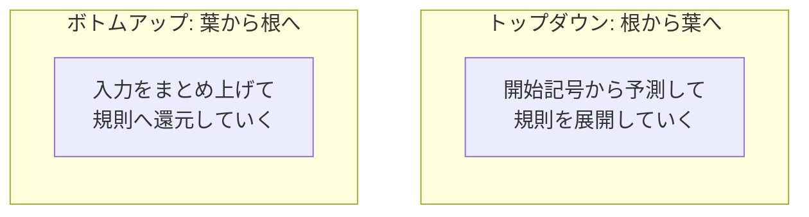

# パーサの理論

ここまで、手書きパーサと各種ジェネレータを「使う」側から見てきました。本章では視点を裏側へ移し、それらを支える理論を覗きます。「なぜ LR は左再帰を扱えるのか」「ANTLR の言う先読みとは何を見ているのか」「PEG が曖昧にならないのはなぜか」 ── これまで保留してきた問いに、ここで答えを与えます。数式は最小限に抑え、アイデアの筋道を追うことを優先します。この章を読み終えると、構文解析のツール群が**いくつかの基本原理の組み合わせ**でできていることが見えてくるはずです。

## 言語のクラスと構文解析の地図

まず全体地図から始めましょう。形式言語には、表現力の階段があります。言語学者チョムスキーが整理したこの階段は **チョムスキー階層** と呼ばれ、構文解析に関係するのは下の2段です。

- **正規言語（regular language）**：正規表現や有限オートマトンで表せる範囲。第1章で字句解析の守備範囲とした層です。括弧の対応のような「数を覚える」処理はできません。
- **文脈自由言語（context-free language）**：文脈自由文法（CFG）で表せる範囲。入れ子・再帰を扱え、構文解析の主戦場です。

第1章で「正規表現だけでは括弧の対応がチェックできない」と述べた理由がここにあります。正規言語は本質的に「有限個の状態しか覚えられない」ため、いくつ括弧が開いたかを無制限に数えられないのです。括弧の対応を扱うには、一段上の文脈自由言語、すなわち CFG が必要になります。これが字句解析（正規言語）と構文解析（文脈自由言語）を分ける理論的な理由です。

> [!NOTE]
> ここでいう「正規表現」は、形式言語理論上の正規表現 ── 有限オートマトンと同じ表現力を持つもの ── を指します。PCRE や Oniguruma、.NET の regex など実用の正規表現エンジンには、後方参照や再帰（サブルーチン呼び出し）といった正規言語を**超える**拡張を持つものがあり、それらを使えば括弧の対応も書けてしまいます。「正規表現では括弧対応ができない」は、あくまで理論上の正規表現についての話です。

CFG をどう解析するかには、大きく二つの戦略があります。前章までに名前だけ出してきた**トップダウン**と**ボトムアップ**です。両者は構文木をどちらの端から組むかが違います。



トップダウンは「次に来るべきもの」を文法から**予測（predict）**しながら根から下る方式で、再帰下降・LL・PEG がこの仲間です。ボトムアップは入力を読みながら「まとまった部分」を規則に**還元（reduce）**して根へ上る方式で、LR・LALR がこの仲間です。以下、それぞれの代表的な手法を見ていきます。

## トップダウンの理論：LL とは何か

第3章の再帰下降パーサは、各非終端記号で「次のトークンを見て、どの規則を使うか決める」ことで進みました。この「左から入力を読み（Left-to-right）、左端の規則から導出する（Leftmost derivation）」方式を **LL 構文解析** と呼びます。`k` 個のトークンを先読みして規則を決めるなら **LL(k)**、1個なら **LL(1)** です。

### FIRST 集合と FOLLOW 集合

LL パーサが「どの規則を使うか」を正しく決めるには、各規則について「その規則を使ったとき、入力の先頭にどんなトークンが来うるか」を知る必要があります。これを形式化したのが **FIRST 集合** です。非終端記号 `A` の FIRST 集合とは、「`A` から導出される文字列の**先頭**になりうる終端記号の集合」です。たとえば `factor ::= "(" expr | number` なら、`FIRST(factor) = { "(", number }` です。先読みした1トークンがこの集合のどこに属するかで、どの選択肢へ進むか決められます。

もう一つ必要なのが **FOLLOW 集合** です。これは「ある非終端記号の**直後**に来うる終端記号の集合」で、規則が空（ε, イプシロン）に展開されうる場合に「その規則を空として畳んで次へ進むべきか」を判断するのに使います。FIRST と FOLLOW を文法全体について計算する手続きは機械的に定まっており、ドラゴンブック[](#cite:aho2006)に標準的なアルゴリズムが載っています。LL(1) パーサジェネレータは、この2つの集合から「状態×先読みトークン→使う規則」という**予測表（parsing table）**を作ります。

### LL の限界 ── なぜ左再帰がだめなのか

ここで第3章の宿題、「なぜトップダウンは左再帰を扱えないのか」に理論的な答えが出せます。LL は「次の規則を**予測してから**入力を消費する」方式です。ところが `expr ::= expr "+" term` のような左再帰では、`expr` を展開しようとした瞬間にまた `expr` が現れ、1トークンも消費しないまま予測が無限に続きます。予測駆動という LL の本質が、左端の自己参照と噛み合わないのです。だからこそ第3章では繰り返しへ書き換える必要がありました。

LL(1) で扱える文法のクラスは限られます。先読み1個で選択肢を区別できない文法（たとえば2つの規則の FIRST 集合が重なる場合）は LL(1) では扱えません。先読みを増やした LL(k) や、前章で触れた ANTLR の ALL(\*)[](#cite:parr2014)は、この「区別できる範囲」を広げる試みだったと理解できます。ALL(\*) の「動的解析」とは、静的な FIRST/FOLLOW では足りないぶんを、実行時に実際の入力で先を試して補う仕掛けだったわけです。

## ボトムアップの理論：LR とは何か

トップダウンが「予測」で進むのに対し、ボトムアップは「現実を積み上げてから判断」します。入力トークンをスタックに積んでいき（**シフト, shift**）、スタックの先頭が何かの規則の右辺と一致したら、それを左辺へ畳む（**還元, reduce**）。この **シフト還元構文解析（shift-reduce parsing）** こそ、yacc／Bison が使う方式の正体です。LR パーサは、入力を左から読みながら（Left-to-right）、**右端導出（Rightmost derivation）を逆向きにたどる**ように構文木を組み上げます。これが **LR 構文解析** という名前の由来で、「Left-to-right, Rightmost derivation in reverse」の略と説明されることもあります。その理論は Knuth が1965年に確立しました[](#cite:knuth1965)。

LR がボトムアップであるおかげで、**左再帰を自然に扱えます**。`expr ::= expr "+" term` は、入力を積み上げていって「`expr + term` という形ができたら還元する」だけなので、予測の無限ループは起きません。前章で「Bison では左再帰をそのまま書ける」と述べた理由が、ここで理論的に裏付けられます。

### LR 項とオートマトン

LR パーサの心臓部は、「いま規則のどこまで読み終えたか」を表す **項（item）** という概念です。項は、規則の右辺に「ここまで読んだ」を示す点（ドット）を打ったものです。たとえば規則 `expr ::= expr "+" term` に対して、

```text
expr ::= expr • "+" term     (expr まで読んだ。次に + を期待)
expr ::= expr "+" • term     (expr + まで読んだ。次に term を期待)
expr ::= expr "+" term •     (全部読んだ。還元できる)
```

の3つの項が考えられます。ドットが右端まで来た項は「この規則で還元せよ」の合図です。LR パーサは、こうした項の集まりを**状態**とする有限オートマトンを構築します。各状態は「現在ありうる項の集合」を表し、トークンを読むごとに状態を遷移します。この**LRオートマトン**を表に落としたものが、前章で `.c` ファイルの中に見た巨大な数値表 ── **構文解析表** ── の正体です。表には「この状態でこのトークンを見たらシフトせよ／この規則で還元せよ」が書き込まれています。

### LR(0)・SLR・LALR・LR(1) ── 強さと大きさのトレードオフ

LR には、先読みをどう扱うかで段階があります。これらの違いは「還元すべきか判断する精度」と「表の大きさ」のトレードオフとして理解できます。

- **LR(0)**：先読みを一切使わず、状態だけで判断する。最も単純だが、扱える文法はごく狭い。
- **SLR(1)**：還元の判断に FOLLOW 集合を使う。LR(0) より扱える文法が広がる。
- **LALR(1)**：「同じ核を持つ状態」を併合して表を小さく保ちつつ、LR(1) に近い精度を得る。**yacc／Bison が採用しているのがこれ**です。実用上の絶妙な落としどころで、Frank DeRemer が1969年の博士論文で導入しました[](#cite:deremer1969)。
- **LR(1)（正準LR）**：各状態が1トークン先読みの情報をフルに持つ。最も強力だが、状態数（表）が巨大になりがち。

LALR(1) が実務で勝ち残ったのは、「LR(1) なみの表現力を、ずっと小さい表で実現できる」からです。ただし状態を併合する副作用として、LR(1) なら起きないコンフリクトが LALR(1) では起こりうる場合があります。前章で出会った「コンフリクト」は、まさにこの精度の限界が顔を出したものでした。LALR(1) の表を効率よく計算するアルゴリズムは長らく研究され、DeRemer と Pennello が先読み集合の効率的な計算法を与えたこと[](#cite:deremer1982)で実用的な規模の文法が扱えるようになりました。現代のコンパイラ教科書[](#cite:cooper2011)も、この LR 系の構築法を中心的に解説しています。

> [!NOTE]
> 「LL は左再帰がだめで右再帰OK、LR は左再帰がむしろ得意」という対比は、トップダウン／ボトムアップの本質をよく表しています。LL は規則を予測してから降りるので左端の自己参照に弱く、LR は積み上げてから畳むので左端の自己参照に強い。どちらが優れているという話ではなく、**進む向きが逆**なのです。

## PEG の理論：曖昧さが消える理由

第5章で PEG の順序付き選択を「曖昧性が原理的にない」と紹介しました。理論的にはどういうことか、ここで詰めます。CFG は「**どんな文字列が言語に属するか**」を定義する**生成的（generative）**な枠組みです。`A | B` は「A か B のどちらの導出も認める」ので、同じ文字列に複数の導出（=複数の木）がありえ、それが曖昧性でした。

これに対し PEG は、Ford が示したように[](#cite:ford2004)、「**与えられた文字列をどう解析するか**」を定義する**認識的（recognition-based）**な枠組みです。順序付き選択 `A / B` は「まず A を試し、ダメなら B」という**決定的な手続き**そのものを表します。手続きが決定的なので、結果は常に一意 ── これが「曖昧性が存在しえない」ことの正体です。PEG はいわば、文法の見た目をしながら中身は「実行手順の記述」になっているのです。

この決定性は強力ですが、第5章で触れた代償も理論から説明できます。第一に、PEG の選択は左を優先するため、CFG なら表せる「両方の解釈を許す」言語は表せません。第二に、PEG が CFG の正確にどの範囲を表現できるのかは完全には解明されておらず、両者の関係そのものが研究対象です。第三に、無制限の先読みとバックトラックを許すため素朴には遅く、これを線形時間にするのがパックラット構文解析のメモ化[](#cite:ford2002)でした ── ここで第5章の実装技法が理論とつながります。

## 一般の CFG をすべて解く：Earley 法

LL も LR も、扱える文法のクラスに制限がありました（コンフリクトの出る文法は扱えない）。では「**どんな**文脈自由文法でも、曖昧なものすら含めて解析する」ことはできるのでしょうか。できます。その代表が **Earley 法** で、Jay Earley が1970年に発表しました[](#cite:earley1970)。

Earley 法は、入力位置ごとに「いまどの規則のどこまで読み終えた可能性があるか」を表す項の集合を保持しながら左から右へ進む点で、LR と似た発想を持ちます。違いは、LR が事前に一つのオートマトンへ固めてしまうのに対し、Earley は**解析しながら、その入力に対してありうる項をすべて動的に管理する**点です。これにより、左再帰だろうが曖昧だろうが、あらゆる CFG を扱えます。曖昧な文法に対しては、ありうる複数の解析（複数の木）をすべて表現できます。

代償は計算量です。Earley 法は一般の文法に対して入力長 `n` の3乗 `O(n³)` の時間がかかりえます（曖昧でない文法なら `O(n²)`、LR で扱えるような素直な文法なら `O(n)` に落ちます）。LR の `O(n)` と比べると重く、プログラミング言語のような「素直な文法」をひたすら速く解析したい用途には過剰です。一方、自然言語処理のように文法が本質的に曖昧で、すべての解釈が欲しい場面では Earley のような汎用解析が活きます。次章で扱う GLR も、この「一般の CFG を解く」系譜に連なります。

## Pratt 構文解析 ── 実用の知恵

理論の章の締めに、第3章で予告した **Pratt 構文解析（演算子順位解析）** を回収します[](#cite:pratt1973)。これは LL／LR のような「文法クラスの理論」とは少し毛色が違い、**式の解析に特化した実用的なテクニック**です。

第3章では、優先順位を `expr`／`term`／`factor` という関数の階層で表しました。しかし優先順位の段が10段あれば関数も10個必要で、煩雑です。Pratt 法は、この階層を関数ではなく**「束縛力（binding power）」という数値**で表します。各演算子に「左の項を引き寄せる力」と「右の項を引き寄せる力」を数値で与え、再帰下降のループの中で「いま処理中の演算子より束縛力の強い演算子が右に続く限り、それを先に結合する」と判断します。これだけで、何段の優先順位でも単一の関数で、しかも左結合・右結合（べき乗のような）も自在に扱えます。

Pratt 法は理論的な美しさよりも実装の簡潔さで愛され、多くの手書きインタプリタや言語処理系が式の部分にこれを採用しています。再帰下降（LL系）の枠内にありながら、優先順位という実用上の難所を鮮やかに片付ける ── 理論と実用の橋渡しのような技法です。

## まとめ

- 字句解析が**正規言語**、構文解析が**文脈自由言語**を担うのは、括弧の対応を数えるには正規言語では足りないという理論的理由による。
- **トップダウン（LL）**は予測駆動で左再帰に弱く、**ボトムアップ（LR）**は還元駆動で左再帰に強い。両者は進む向きが逆。
- LL は **FIRST/FOLLOW** で予測表を、LR は **項とオートマトン** で構文解析表を作る。**LALR(1)** は表現力と表サイズの実用的な妥協点で、yacc／Bison が採用する。
- **PEG** は順序付き選択により決定的＝曖昧性なし。代償は左再帰非対応と CFG との表現力の差。
- **Earley 法** は一般の CFG をすべて（曖昧なものも）解けるが `O(n³)` と重い。
- **Pratt 法** は式の優先順位を束縛力の数値で扱う実用テクニック。

理論の土台ができたところで、次章ではこの基礎の上に立つ**最先端**へ進みます。GLR・GLL、微分によるパース、インクリメンタル解析、エラー回復 ── 現役の研究テーマたちを訪ねましょう。
